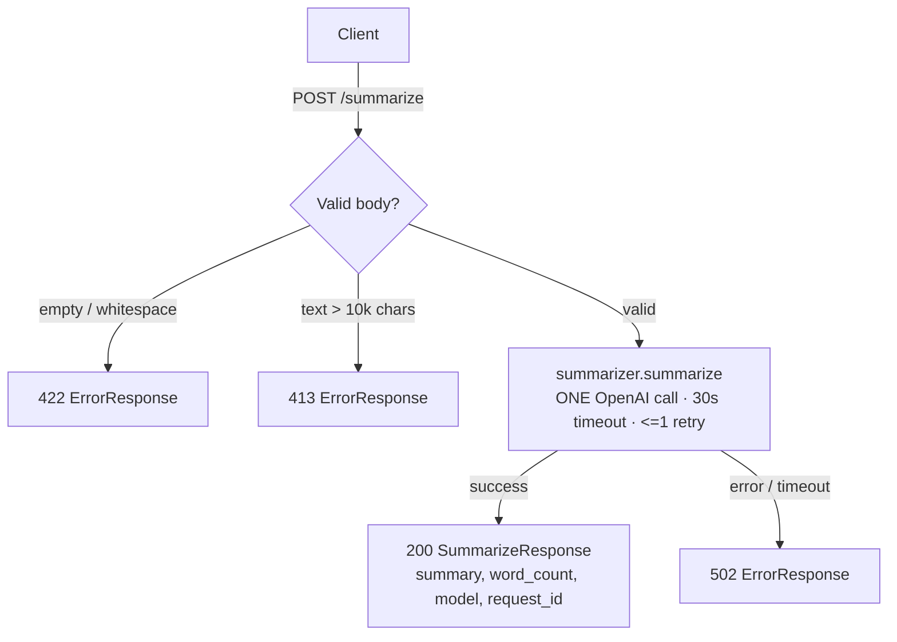

# Design Document

## Overview

The Summarization API exposes one route, `POST /summarize`. A request is validated by Pydantic,
guarded against oversize input, forwarded to a single OpenAI call isolated in a service module, and
returned as a typed JSON response. Every response carries a `request_id` (and matching
`X-Request-ID` header). Bad input is rejected before any model call; upstream failures map to a 502
with a safe body. The caller's text never reaches a log or an error message.

This design realizes every acceptance criterion in `requirements.md`. The traceability trailers in
`tasks.md` map each task back to the requirement it satisfies.

## Architecture

The request lifecycle is: validate → (guard) → one model call → build response, with two early-reject
paths and one upstream-failure path.



Layering is strict and inward-pointing: `api/` (HTTP concerns) depends on `services/` (the model
call) depends on `core/` (config, logging). A request-id middleware wraps the whole app so the id is
available to every layer and stamped on every response.

## Components and Interfaces

- **`api/routes.py`** — declares `POST /summarize`. Relies on Pydantic for the 422, enforces the 10k
  cap as a 413 *before* any call, invokes the summarizer on valid input, computes `word_count`, and
  builds `SummarizeResponse`.
- **`api/errors.py`** — exception handlers mapping `PayloadTooLargeError` → 413, validation → 422,
  and `SummarizerError` → 502, each returning an `ErrorResponse` with no stack trace and no user text.
- **`services/summarizer.py`** — `summarize(client, text, max_words)`: the single
  `client.chat.completions.create(...)` call with a 30s timeout and at most one retry; folds
  `max_words` into the system prompt; raises `SummarizerError` on failure. The client is injected via
  a FastAPI dependency so tests supply a mock.
- **`core/config.py`** — `Settings` read from the environment (API key, model, timeout, cap, retries).
- **`core/logging.py`** — a logger that emits metadata only and cannot serialize the request body.
- **`main.py`** — `create_app()` wires the request-id middleware, the exception handlers, and the router.

## Data Models

Pydantic v2 models (`models/schemas.py`):

```python
class SummarizeRequest(BaseModel):
    text: str = Field(min_length=1)              # 10k cap is a route-level 413, not max_length
    max_words: int | None = Field(default=150, ge=1, le=1_000)

class SummarizeResponse(BaseModel):
    summary: str
    word_count: int
    model: str
    request_id: str

class ErrorResponse(BaseModel):
    error: str
    request_id: str
```

The schema enforces only *non-empty* text (empty/whitespace → 422). The 10,000-character cap is a
route-level **413** — a `max_length` on the model would surface oversize input as a 422, the wrong
status for Requirement 2.2.

## Error Handling

| Condition | Status | Body | Model call? |
|-----------|--------|------|-------------|
| Empty / whitespace `text` | 422 | `ErrorResponse` | no |
| `text` > 10,000 chars | 413 | `ErrorResponse` | no |
| Model error or 30s timeout | 502 | `ErrorResponse` | attempted (+≤1 retry) |
| Success | 200 | `SummarizeResponse` | exactly one |

Failures are never swallowed into a 200. Handlers emit `error` + `request_id` only — never the
provider's raw error, a stack trace, or the caller's text.

## Testing Strategy

- **Mocked model client** injected via the FastAPI dependency — the suite makes no live network call.
- **Unit** (`test_schemas.py`, `test_summarizer.py`): schema validation and `word_count`; exactly one
  call, `max_words` reaching the model, provider error → `SummarizerError`.
- **Integration** (`test_summarize_route.py`): 200 happy path, 422 empty (no call), 413 oversize (no
  call), 502 upstream failure, `X-Request-ID` on success and error.
- **Privacy test:** seed a unique marker into `text`, exercise happy and failure paths, capture all
  log records and the error body, and assert the marker appears nowhere.
