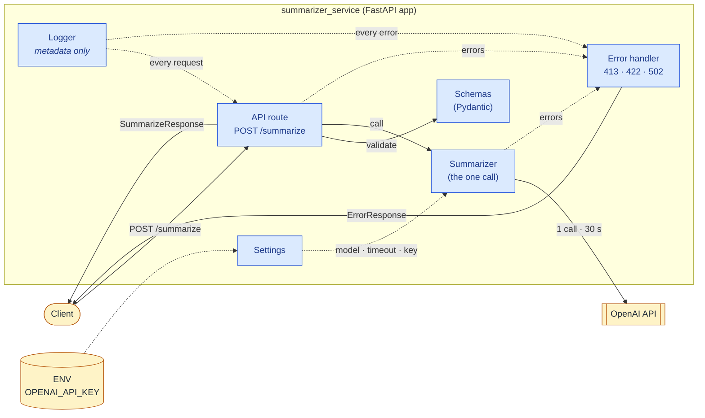
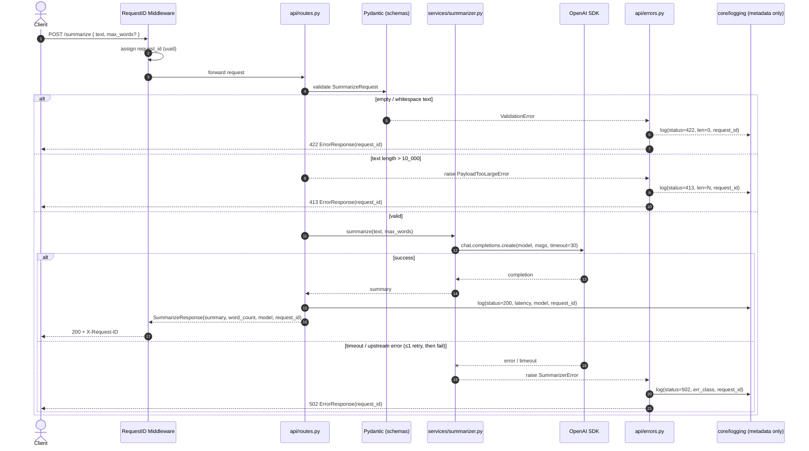
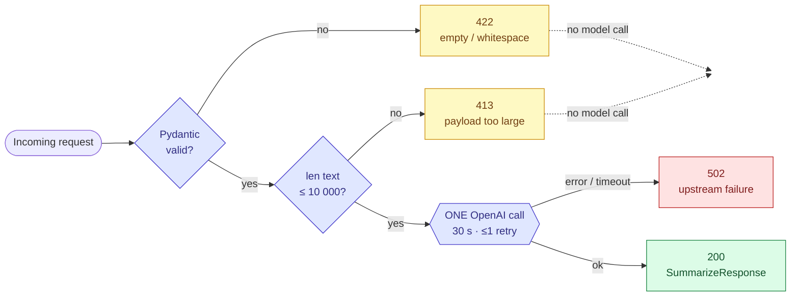
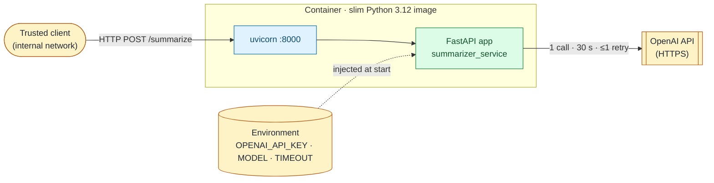

# Architecture — Summarization Service

> **One endpoint. One model call. Layered, stateless, mockable.**
> The diagrams below are the source of truth for component boundaries, the request lifecycle, and
> the status-code decision flow. See `spec.md` for behavior and contracts.

---

## 1. Component view

The main pieces of the service and how they talk to each other.
Solid arrows = a normal call. Dashed arrows = something used in the background (config, logs).

| Component | Role |
|-----------|------|
| **Client** | Anyone that calls `POST /summarize`. External. |
| **API route** | Receives the request, runs the 10k guard, calls the service, builds the response. |
| **Schemas** | Pydantic models that validate input and shape output. |
| **Summarizer** | Makes the **single** OpenAI call (30 s timeout, ≤1 retry). |
| **Error handler** | Turns failures into clean `413 / 422 / 502` `ErrorResponse`s. |
| **Settings** | Reads `OPENAI_API_KEY`, model name, timeout from `.env`. |
| **Logger** | Writes **metadata only** (request id, length, status, latency). Never the user's text. |
| **OpenAI API** | External LLM provider. |

---

## 2. Request lifecycle (sequence)

---

## 3. Status-code decision flow

---

## 4. Module map

| Layer       | Module                  | Responsibility                                                  | Imports from                |
|-------------|-------------------------|-----------------------------------------------------------------|-----------------------------|
| App         | `main.py`               | `create_app()` · middleware · router registration               | `api/`, `core/`             |
| HTTP        | `api/routes.py`         | `POST /summarize` — validate → 413 guard → call → build         | `models/`, `services/`, `core/` |
| HTTP        | `api/errors.py`         | Map `PayloadTooLargeError` / `SummarizerError` / validation → 413 / 502 / 422 | `models/`, `exceptions`     |
| Domain      | `services/summarizer.py`| The single OpenAI call (timeout + ≤1 retry). Mockable.          | `core/config`, `openai`     |
| Contracts   | `models/schemas.py`     | `SummarizeRequest` / `SummarizeResponse` / `ErrorResponse`      | `pydantic`                  |
| Core        | `core/config.py`        | `Settings` from env (key, model, timeout, caps, retries)        | `os` / `pydantic-settings`  |
| Core        | `core/logging.py`       | Metadata-only logger. **Never the user's text.**                | `logging`                   |
| Cross       | `exceptions.py`         | `SummarizerError`, `PayloadTooLargeError`                       | —                           |

---

## 5. Runtime topology

**Stateless · no DB · no cache · no auth (v1).** Horizontal scaling is "run more containers."

---

## 6. Architectural invariants

| # | Invariant                                                   | Enforced by                       | Spec ref |
|---|-------------------------------------------------------------|-----------------------------------|----------|
| I1 | Exactly **one** OpenAI call per successful request          | `services/summarizer.py`          | R9, §6   |
| I2 | **No model call** for invalid input (422 / 413)             | `api/routes.py` (guard before call)| R2, R3   |
| I3 | **No raw user text** in logs, traces, or responses          | `core/logging.py` · `api/errors.py`| R7, §3   |
| I4 | Secrets only from env; never returned, never logged         | `core/config.py`                  | §3       |
| I5 | Every response carries `request_id` + `X-Request-ID` header | RequestID middleware in `main.py` | R5       |
| I6 | The model client is **injectable** (FastAPI dependency)     | `services/summarizer.py`          | §7 (tests) |
| I7 | Stateless — no session, no persistence                      | Whole app                         | §6       |
